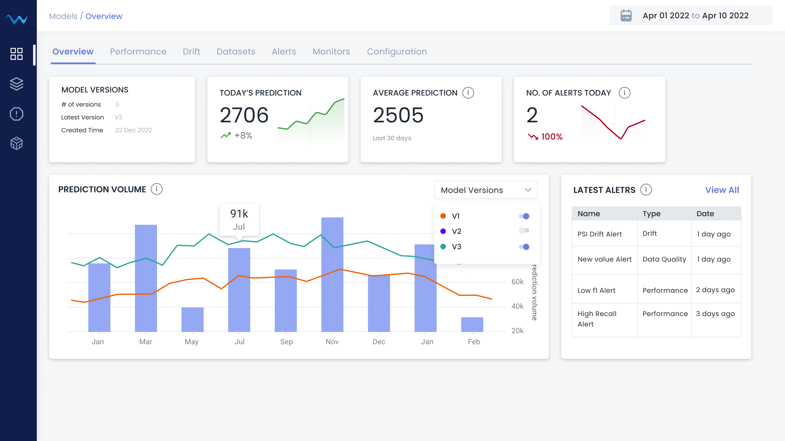
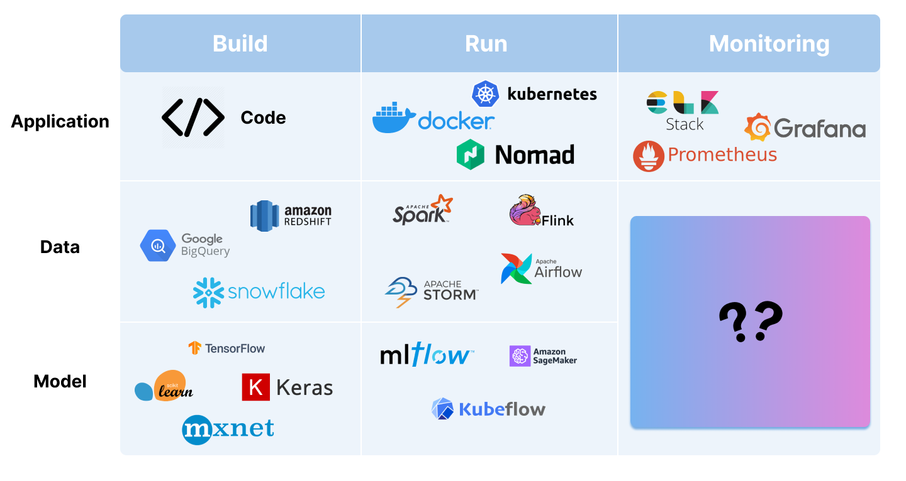

    

<h2 align="center">
 Open Source ML Observability Platform
</h2>

⭐️ If you like it, star the repo  ⭐

**|**
<a href="https://docs.waterdip.ai/">**Docs**</a>
**|**
<a href="https://discord.gg/Qt4v3fjf/">**Discord**</a>
**|**

## What is Waterdip?

Waterdip is an Open Source ML Observability platform that allows ML Engineers and data scientists to observe their models' performance at scale.

## Way ML Observability is needed?

**APM (Application Performance Monitoring)** tools are used to monitor the performance of applications. AMP tools are kind if mandatory part of dev stack. Without AMP tools, it is very difficult to monitor the performance of applications.

But for Data and ML products regular APM tools are not enough. We need a new kind of tools that can monitor the performance of Data and ML applications.

ML Observability tools are used to monitor the performance of ML models. ML Observability tools help to monitor the performance of ML models in production. It helps to identify the root cause of the model performance issues and helps to improve the model performance.

## Quick start

Please visit the [Quick Start Guide](https://docs.waterdip.ai/introduction/quick_start/)

## Community & Support

For additional information and help, you can use one of these channels:

* [Discord](https://discord.gg/Qt4v3fjf/) \(Live chat with the team, support, discussions, etc.\)
* [GitHub issues](https://github.com/waterdipai/waterdip/issues) \(Bug reports, feature requests)

## **Contributions**

:raised_hands: We greatly appreciate contributions - be it’s a bug fix, new feature, or documentations!

Check out the [contributions guide](https://github.com/waterdipai/waterdip/blob/main/CONTRIBUTING.md) and [open issues](https://github.com/waterdipai/waterdip/issues).

**Waterdip contributors: :blue_heart:**

