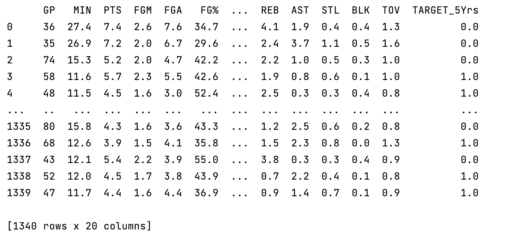

# **Binary Classification**

## **Data Example**

Dataset for practicing classification -use NBA rookie stats to predict if player will last 5 years in league

y = 0 if career years played < 5
y = 1 if career years played >= 5

[Data reference](https://data.world/exercises/logistic-regression-exercise-1)



## **Register a Binary Classification Model**

Code snippet for registering Binary Classification Model

```python


```